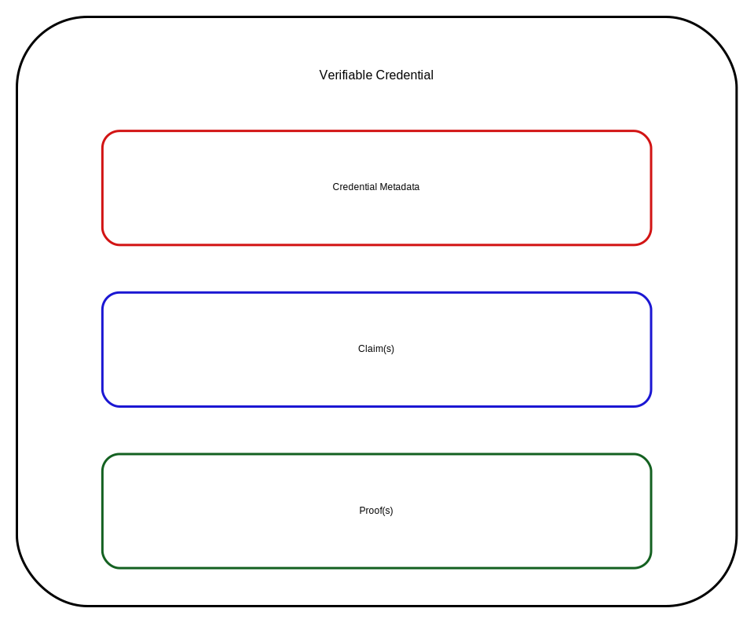
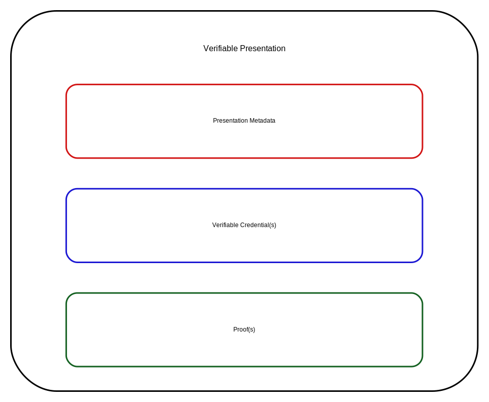

# Verifiable Credentials Structure for Agentic AI

## Overview
This document outlines a flexible, compatible, and universal structure for verifiable credentials (VCs) enforced on agentic AI systems. Based on W3C Verifiable Credentials Data Model, it incorporates scopes for usage, permissions, and requirements to enable secure, interoperable agent interactions.

## Visual Guide
The diagrams below explain the VC structure, lifecycle roles, and the concrete contents of a credential and presentation.

### Credential Anatomy

*Displays the credential envelope and its three main sections: metadata, claim(s), and proof(s). This helps readers understand the structure of a Verifiable Credential.*

### Credential Lifecycle

*Shows the trust ecosystem for credentials, including issuer, holder, verifier, registry, and lifecycle actions such as issue, present, check status, revoke, and verify.*

### Credential Payload Example

*Depicts a sample credential payload with issuer URI, credential subject identifier, claims such as name and alumniOf, issuance details, and the proof container.*

### Presentation Structure

*Illustrates the Verifiable Presentation format, showing presentation metadata, wrapped Verifiable Credential(s), and corresponding proof(s).* 

## Metadata and Lifecycle Details

### Credential Metadata
The label `Credential Metadata` represents the top-level fields that identify and version a credential. In practice these fields include:
- `@context`: the JSON-LD context definitions
- `id`: a globally unique credential identifier
- `type`: credential types such as `VerifiableCredential` plus specialized profile names
- `issuer`: the entity issuing the credential
- `issuanceDate`: when the credential was created
- `expirationDate`: when the credential expires
- `credentialSchema`: optional schema reference for validation
- `credentialStatus`: optional revocation or status endpoint reference

Credential metadata is the part of the VC that tells verifiers what kind of credential it is, who issued it, when it is valid, and how to validate it.

### Claim(s)
The `Claim(s)` section contains the assertions about the subject. It is typically expressed as the `credentialSubject` object and includes:
- `id`: the subject's identifier, often a DID or URI
- subject-specific claims such as `name`, `alumniOf`, `role`, or `scope`
- authorization claims like `permissions`, `resourceConstraints`, and `trustScore`
- custom data needed by consuming systems

A real-world claim payload looks like a structured object rather than free-form text, which allows verifiers to validate individual claims and apply policy checks.

### Proof(s)
The `Proof(s)` section is the cryptographic layer. It contains:
- `type`: signature suite type such as `Ed25519Signature2020`
- `created`: proof creation timestamp
- `verificationMethod`: the key or DID used to sign
- `proofPurpose`: usually `assertionMethod` or `authentication`
- `proofValue` or `jws`: the signature material
- optional `challenge` / `domain` values for presentation security

Proofs are what make the credential verifiable: they prove the issuer actually signed the claims and that the data has not been altered.

### Presentation Metadata
`Presentation Metadata` is the wrapper around one or more credentials when a holder presents them to a verifier. It typically includes:
- `@context`: context declarations for the presentation
- `type`: includes `VerifiablePresentation`
- `holder`: the entity presenting the credential(s)
- `verifiableCredential`: an array of embedded credential objects
- `proof`: a presentation-level proof that binds the holder to the presentation
- optional `challenge` and `domain` fields for replay protection

This metadata is what distinguishes a standalone credential from the act of presenting it in response to a request.

### Lifecycle Actions in the Diagram
The ecosystem diagram labels actions that describe how credentials move through their lifecycle:
- `Issue` (exactly once): a credential is issued one time by the issuer and becomes bound to the subject.
- `Present` (repeatable): the holder may present the credential to multiple verifiers repeatedly.
- `Check Status` (might NOT preserve privacy, repeatable): verifiers may query status or revocation endpoints repeatedly; this step can expose usage metadata unless privacy protections are in place.
- `Revoke` (up to once): the credential may be revoked by the issuer. Once revoked, that version is no longer valid.
- `Verify` (repeatable): each presentation or use of the credential should be verified again, checking signature, issuer, status, and expiry.
- `Delete` (up to once per holder): a holder can remove their local copy of a credential, which is a local privacy action.
- `Transfer` (repeatable): if permitted, credentials or presentations can be shared or transferred across parties.


## Key Components

### 1. Credential Schema
- **Type**: Extensible JSON-LD schema (e.g., `VerifiableCredential`, `AgentPermissionCredential`).
- **Context**: Uses standard vocabularies like `@context` from W3C VC.
- **Claims**: Flexible fields for custom data, including:
  - `scope`: Defines usage contexts (e.g., "data_access", "action_execution").
  - `permissions`: Lists allowed actions (e.g., ["read", "write", "execute"]).
  - `requirements`: Prerequisites (e.g., minimum trust score, expiration).

### 2. Issuer
- Entity (human or AI) issuing the credential.
- Must provide cryptographic proof (e.g., digital signature using Ed25519 or ECDSA).

### 3. Holder
- Agentic AI entity holding the credential.
- Stores VC in a secure wallet (e.g., DID-based).

### 4. Verifier
- Agent or system verifying the credential before granting access.
- Checks proof, issuer validity, and claim compliance.

### 5. Proof
- Cryptographic mechanism: Linked Data Proofs or JWT.
- Ensures integrity and authenticity.

## Enforcement Mechanism
- **Pre-Action Check**: Agents query verifiers with presented VC before executing actions.
- **Policy Engine**: Evaluates scopes, permissions, resource constraints, and delegation rules.
- **Revocation**: Support for credential revocation lists (e.g., via DID status) with emergency invalidation.
- **Audit Trail**: All credential usage logged with timestamps, agent ID, action, and result.
- **Real-time Monitoring**: Continuous evaluation of constraints (rate limits, resource consumption).

## Granular Permission Matrix

### Core Action Categories
| Action Category | Sub-Actions | Default Scope | Risk Level |
|---|---|---|---|
| **Data Operations** | read, write, delete, export, transform | data_access | Medium |
| **System Operations** | list, create, update, deploy, undeploy | system_admin | High |
| **Execution Control** | run, pause, resume, terminate, schedule | execution | Medium |
| **Credential Management** | issue, verify, revoke, delegate | credential_mgmt | Critical |
| **Monitoring & Audit** | view_logs, view_metrics, generate_reports | monitoring | Low |
| **Integration** | call_external_api, webhook_trigger, plugin_load | integration | High |

### Permission Levels
1. **Level 0 (None)**: No access
2. **Level 1 (Read-Only)**: View, list, get operations only
3. **Level 2 (Constrained Write)**: Write with approval/limits
4. **Level 3 (Full Write)**: Unrestricted write within scope
5. **Level 4 (Administrative)**: Includes delegation and policy changes

### Scope Hierarchies
```
Root (all scopes)
├── Data Management
│   ├── data_read (specific datasets)
│   ├── data_write (specific datasets)
│   └── data_delete (specific datasets)
├── System Administration
│   ├── agent_creation
│   ├── agent_termination
│   ├── policy_modification
│   └── resource_allocation
├── Execution Control
│   ├── task_execution (specific task types)
│   ├── task_scheduling
│   └── task_monitoring
└── Credential & Security
    ├── credential_issuance
    ├── credential_revocation
    └── trust_management
```

## Resource Constraints

### CPU & Memory Limits
```json
{
  "resourceConstraints": {
    "cpu": {
      "max_percent": 25,
      "max_duration_seconds": 3600,
      "burst_allowed": true,
      "burst_percent": 50,
      "burst_duration_seconds": 60
    },
    "memory": {
      "max_mb": 2048,
      "max_concurrent_tasks": 5,
      "priority_level": "normal"
    },
    "storage": {
      "max_gb": 100,
      "cache_gb": 10,
      "retention_days": 30
    }
  }
}
```

### Rate Limiting
- **API Calls**: Max requests per minute/hour/day
- **Data Transfer**: Max bytes per operation, max bandwidth
- **Task Execution**: Max concurrent tasks, max queued tasks
- **Credential Operations**: Max issuances per period, delegation depth limit

### Quota Management
- **Shared Pool**: Multiple agents share organization quota
- **Individual Ceiling**: Per-agent hard limits
- **Grace Period**: Soft limits with warnings before enforcement
- **Throttling Policy**: Linear or exponential backoff on limit breach

## Agent Personas & Capability Levels

### Persona: Data Reader Agent
**Use Case**: Analytics, reporting, data exploration
```json
{
  "agentType": "DataReaderAgent",
  "capabilityLevel": 1,
  "permissions": {
    "data_access": {"level": 1, "actions": ["read", "transform"], "datasets": ["public", "internal"]},
    "monitoring": {"level": 1, "actions": ["view_logs", "view_metrics"]},
    "execution": {"level": 0}
  },
  "resourceConstraints": {
    "cpu_percent": 15,
    "memory_mb": 1024,
    "concurrent_tasks": 3
  },
  "trustRequirements": {"minTrustScore": 0.7, "requiresApproval": false}
}
```

### Persona: Task Executor Agent
**Use Case**: Automated workflows, scheduled jobs, integrations
```json
{
  "agentType": "TaskExecutorAgent",
  "capabilityLevel": 2,
  "permissions": {
    "data_access": {"level": 2, "actions": ["read", "write"], "datasets": ["workflow_data"], "requiresApproval": ["delete"]},
    "execution": {"level": 3, "actions": ["run", "schedule", "pause"], "taskTypes": ["processing", "integration"]},
    "monitoring": {"level": 2, "actions": ["view_logs", "view_metrics"]},
    "integration": {"level": 2, "actions": ["call_external_api"], "allowedEndpoints": ["api.service.com/*"]}
  },
  "resourceConstraints": {
    "cpu_percent": 35,
    "memory_mb": 2048,
    "concurrent_tasks": 10,
    "api_calls_per_hour": 10000
  },
  "trustRequirements": {"minTrustScore": 0.8, "requiresApproval": ["external_integration"]}
}
```

### Persona: Administrative Agent
**Use Case**: System management, agent lifecycle, policy enforcement
```json
{
  "agentType": "AdminAgent",
  "capabilityLevel": 4,
  "permissions": {
    "system_admin": {"level": 4, "actions": ["create", "update", "deploy", "modify_policy"]},
    "data_access": {"level": 3, "actions": ["read", "write", "delete"]},
    "credential_management": {"level": 4, "actions": ["issue", "revoke", "delegate"]},
    "execution": {"level": 3, "actions": ["run", "terminate", "monitor"]},
    "monitoring": {"level": 4, "actions": ["view_logs", "view_metrics", "generate_reports"]}
  },
  "resourceConstraints": {
    "cpu_percent": 50,
    "memory_mb": 4096,
    "concurrent_tasks": 20,
    "unlimited_critical_operations": true
  },
  "trustRequirements": {"minTrustScore": 0.95, "requiresApproval": ["policy_modification", "credential_revocation"]},
  "auditLevel": "verbose"
}
```

## Delegation & Trust Chains

### Delegation Rules
```json
{
  "delegationPolicy": {
    "maxDelegationDepth": 3,
    "allowDelegation": true,
    "delegationScope": "subset_only",
    "delegationRules": [
      {
        "fromLevel": 3,
        "toLevel": 2,
        "allowedActions": ["data_read", "data_write"],
        "requiresApproval": true
      },
      {
        "fromLevel": 4,
        "toLevel": 3,
        "allowedActions": "all_except_credential_mgmt",
        "requiresApproval": false
      }
    ],
    "delegationAudit": true,
    "delegationExpiry": 86400
  }
}
```

### Trust Chain Verification
- **Issuer Chain**: Verify issuer's issuer in unbroken chain to root authority
- **Revocation Check**: Cross-reference all credentials in chain against revocation lists
- **Temporal Validity**: Check all credentials in chain are currently valid
- **Scope Compatibility**: Verify delegated scope is subset of delegator's scope

## Audit & Compliance

### Audit Trail Schema
```json
{
  "auditEntry": {
    "timestamp": "2026-05-04T14:30:00Z",
    "agentId": "did:example:agent:executor-001",
    "credentialId": "vc:example:credential:abc123",
    "action": "data_write",
    "resource": "dataset:sales_2026",
    "status": "success|denied|throttled",
    "result": "wrote 1500 records",
    "riskScore": 0.3,
    "requiresApproval": false,
    "approverAgent": null,
    "ipAddress": "192.168.1.100",
    "userAgent": "AIAgent/2.1"
  }
}
```

### Compliance Requirements
- **Logging**: All actions logged with agent ID, scope, result, timestamp
- **Retention**: Audit logs retained for 1-7 years per regulation
- **Immutability**: Audit logs stored in append-only ledger (blockchain optional)
- **Alerting**: Real-time alerts on policy violations or suspicious patterns
- **Reporting**: Monthly compliance reports with permission changes, denied actions, trust updates

### Risk Scoring System
- **Trust Score Decay**: Score decreases over time if unused or unused after incident
- **Behavior Anomaly**: Score impacts on unusual access patterns
- **Delegation Chain Risk**: Risk compounds with delegation depth
- **Incident Impact**: Security incident reduces trust score
- **Recovery Path**: Trust score recovers through successful operations and time

## Revocation Policies

### Revocation Triggers
| Trigger | Action | Recovery |
|---|---|---|
| Manual Revocation | Immediate invalidation | Requires new credential issuance |
| Expiration | Automatic invalidation | Credential renewal process |
| Policy Violation | Immediate suspension | 24-48hr review period, then revocation |
| Trust Score Below Threshold | Suspension, then revocation | Trust recovery period |
| Unauthorized Delegation | Immediate revocation | Investigation required |
| Resource Quota Exceeded | Throttling, then suspension | Clear violations, rebuild trust |

### Revocation Implementation
```json
{
  "revocationPolicy": {
    "revocationList": "https://example.com/revoked-credentials",
    "checkFrequency": "real-time",
    "cacheDuration": 300,
    "hardRevocation": ["security_breach", "policy_violation"],
    "softRevocation": ["quota_exceeded", "trust_score_low"],
    "gracePeriod": {"soft": 3600, "hard": 0},
    "notification": {"agent": true, "issuer": true, "auditor": true}
  }
}
```

## Threat Model & Security

### Attack Vectors & Mitigations
| Attack | Risk | Mitigation |
|---|---|---|
| Credential Theft | High | Encryption at rest, TLS in transit, key rotation |
| Privilege Escalation | Critical | Strict permission hierarchy, delegation limits, continuous auditing |
| Delegation Attack (agent A tricks B into delegating high perms) | High | Explicit user approval, audit trails, trust chain verification |
| Revocation Bypass (agent continues after revocation) | Critical | Real-time revocation checks, no caching on critical paths |
| Scope Creep (slowly increasing permissions over time) | Medium | Periodic policy audits, risk scoring, anomaly detection |
| Replay Attack | Medium | Timestamp validation, nonce inclusion, sequence numbers |
| Man-in-the-Middle (credential interception) | Medium | Mutual TLS, end-to-end encryption, certificate pinning |

### Security Controls
- **Encryption**: AES-256 for data at rest, TLS 1.3+ for transit
- **Key Management**: Hardware security modules (HSM) for issuer keys
- **Signing**: Ed25519 or ES256 for cryptographic proofs
- **Validation**: Always verify proof before accepting credential
- **Isolation**: Agent execution in isolated containers with resource limits
- **Sandboxing**: Restrict file system, network access per permission scope

## Implementation Examples

### Example 1: Basic Data Access Credential
```json
{
  "@context": ["https://www.w3.org/2018/credentials/v1", "https://example.com/agent-vc-context"],
  "type": ["VerifiableCredential", "AgentDataAccessCredential"],
  "id": "urn:uuid:3978344f-8596-4c3a-a978-8fcaba3903c5",
  "issuer": "did:example:admin:issuer-001",
  "issuanceDate": "2026-05-01T00:00:00Z",
  "expirationDate": "2027-05-01T00:00:00Z",
  "credentialSubject": {
    "id": "did:example:agent:reader-001",
    "agentType": "DataReaderAgent",
    "scope": ["data_read", "monitoring"],
    "permissions": {
      "data_access": {
        "level": 1,
        "actions": ["read", "transform"],
        "datasets": ["public_data", "analytics_db"],
        "maxRecordsPerQuery": 1000000
      },
      "monitoring": {
        "level": 1,
        "actions": ["view_logs", "view_metrics"],
        "maxLogAge": 30
      }
    },
    "resourceConstraints": {
      "cpu_percent": 15,
      "memory_mb": 1024,
      "concurrent_tasks": 3,
      "api_calls_per_minute": 100
    },
    "trustScore": 0.85,
    "requirements": {
      "minTrustScore": 0.7,
      "requiresApproval": false,
      "mfaRequired": false
    }
  },
  "proof": {
    "type": "Ed25519Signature2020",
    "created": "2026-05-01T00:00:00Z",
    "verificationMethod": "did:example:admin:issuer-001#key-1",
    "proofPurpose": "assertionMethod",
    "proofValue": "z4MXj7..."
  }
}
```

### Example 2: Delegated Task Execution Credential
```json
{
  "@context": ["https://www.w3.org/2018/credentials/v1", "https://example.com/agent-vc-context"],
  "type": ["VerifiableCredential", "AgentDelegatedExecutionCredential"],
  "id": "urn:uuid:5a8c44ff-9987-4d5b-b9e4-8fcaba3903d6",
  "issuer": "did:example:agent:executor-001",
  "issuanceDate": "2026-05-03T10:00:00Z",
  "expirationDate": "2026-05-04T10:00:00Z",
  "credentialSubject": {
    "id": "did:example:agent:sub-executor-002",
    "delegatedFrom": "did:example:agent:executor-001",
    "delegationDepth": 1,
    "delegationType": "temporary_task",
    "scope": ["task_execution", "data_write"],
    "permissions": {
      "execution": {
        "level": 2,
        "actions": ["run", "pause"],
        "taskTypes": ["data_processing"],
        "allowedTasks": ["task:id:12345", "task:id:12346"]
      },
      "data_access": {
        "level": 2,
        "actions": ["read", "write"],
        "datasets": ["temp_workspace"],
        "timeLimit": 3600
      }
    },
    "resourceConstraints": {
      "cpu_percent": 20,
      "memory_mb": 512,
      "execution_time_max": 1800
    },
    "approvalChain": ["did:example:admin:approver-001"],
    "auditLevel": "verbose"
  },
  "proof": {
    "type": "Ed25519Signature2020",
    "created": "2026-05-03T10:00:00Z",
    "verificationMethod": "did:example:agent:executor-001#key-2",
    "proofPurpose": "delegationMethod",
    "proofValue": "z5NYk8..."
  }
}
```

### Example 3: Administrative Policy Enforcement Credential
```json
{
  "@context": ["https://www.w3.org/2018/credentials/v1", "https://example.com/agent-vc-context"],
  "type": ["VerifiableCredential", "AgentAdministrativeCredential"],
  "id": "urn:uuid:7b9e55ff-aaba-5e6c-caff-9fcaba3903e7",
  "issuer": "did:example:organization:root",
  "issuanceDate": "2026-05-01T00:00:00Z",
  "expirationDate": "2027-05-01T00:00:00Z",
  "credentialSubject": {
    "id": "did:example:agent:admin-001",
    "agentType": "AdminAgent",
    "scope": ["system_admin", "credential_management", "policy_enforcement"],
    "permissions": {
      "system_admin": {
        "level": 4,
        "actions": ["create", "update", "deploy", "modify_policy", "allocate_resources"],
        "restrictions": ["cannot_delete_audit_logs", "cannot_modify_root_policy"]
      },
      "credential_management": {
        "level": 4,
        "actions": ["issue", "revoke", "delegate", "rotate_keys"],
        "requiresApproval": ["revoke", "rotate_keys"],
        "approverCount": 2
      },
      "monitoring": {
        "level": 4,
        "actions": ["view_logs", "view_metrics", "generate_compliance_reports", "trigger_incident_response"]
      }
    },
    "resourceConstraints": {
      "cpu_percent": 50,
      "memory_mb": 4096,
      "unlimited_critical_operations": true
    },
    "trustScore": 0.98,
    "requirements": {
      "minTrustScore": 0.95,
      "mfaRequired": true,
      "requiresApproval": ["policy_modification", "credential_revocation"],
      "approvalThreshold": 2
    },
    "policies": {
      "revokeAgentIfTrustBelow": 0.6,
      "enforceQuotas": true,
      "enforceAuditLogging": true
    }
  },
  "proof": {
    "type": "Ed25519Signature2020",
    "created": "2026-05-01T00:00:00Z",
    "verificationMethod": "did:example:organization:root#admin-key",
    "proofPurpose": "assertionMethod",
    "proofValue": "z6MKj9..."
  }
}
```

## Verification & Policy Enforcement Flow

### Pre-Execution Verification (Step-by-step)
1. **Credential Presentation**: Agent presents VC to verifier
2. **Signature Verification**: Verify cryptographic proof with issuer's public key
3. **Issuer Validation**: Check issuer is authorized and not compromised
4. **Revocation Check**: Cross-reference credential ID in revocation list
5. **Temporal Check**: Verify credential within issuance and expiration dates
6. **Trust Score Evaluation**: Calculate risk based on trust score and decay
7. **Permission Matching**: Verify requested action matches credential scope
8. **Resource Availability**: Check resource quotas not exceeded
9. **Delegation Chain Validation**: If delegated, verify entire chain
10. **Approval Requirement**: If action requires approval, queue for review
11. **Audit Logging**: Log verification attempt with result
12. **Decision**: Allow, deny, or throttle operation

### Real-time Constraint Monitoring
- Track CPU/memory usage per agent against limits
- Monitor API call rates and throttle if exceeding limits
- Update trust score based on behavior
- Trigger alerts on suspicious patterns
- Auto-revoke on policy violation

## Implementation Roadmap

### Phase 1: Foundation (Weeks 1-4)
- [ ] Design and implement VC schema validation
- [ ] Build issuer/verifier core components
- [ ] Create basic audit logging system
- [ ] Implement revocation list infrastructure
- [ ] Write unit tests for core functions

### Phase 2: Policy Engine (Weeks 5-8)
- [ ] Build permission matrix evaluation engine
- [ ] Implement resource constraint tracking
- [ ] Create policy verification workflow
- [ ] Add real-time monitoring system
- [ ] Integration tests with sample agents

### Phase 3: Advanced Features (Weeks 9-12)
- [ ] Implement delegation system
- [ ] Add trust scoring and anomaly detection
- [ ] Build compliance reporting tools
- [ ] Create incident response procedures
- [ ] Performance optimization

### Phase 4: Production Hardening (Weeks 13-16)
- [ ] Security audit and penetration testing
- [ ] High-availability deployment setup
- [ ] Backup and disaster recovery
- [ ] Documentation and training
- [ ] GA release

## References
- W3C Verifiable Credentials Data Model: https://www.w3.org/TR/vc-data-model/
- Decentralized Identifiers (DIDs): https://www.w3.org/TR/did-core/
- JSON-LD: https://json-ld.org/
- Ed25519 Signature Suite: https://w3c-ccg.github.io/ld-signatures/